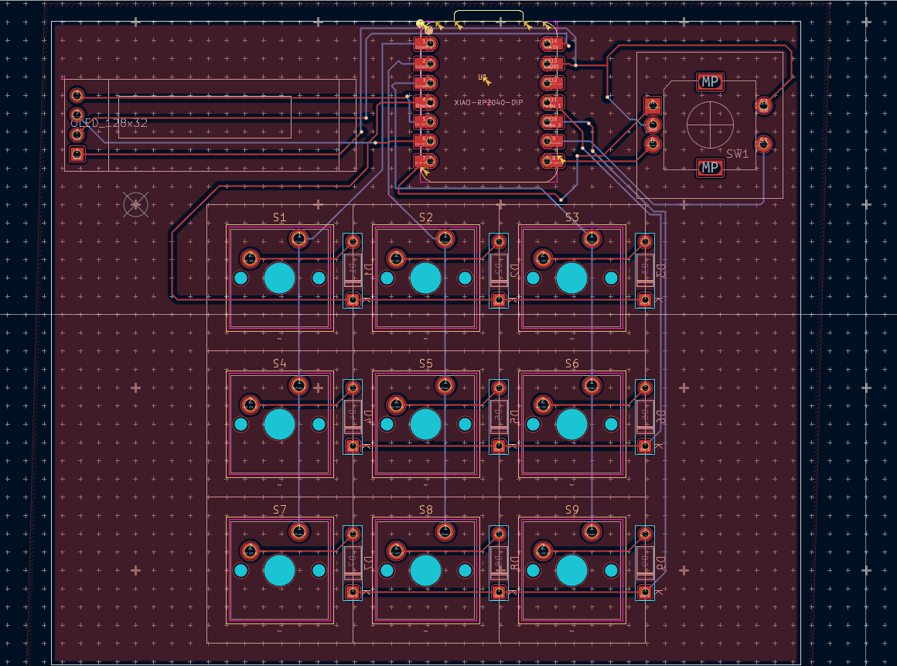

# Akyuu PW0.1

My submission for the blueprint project by hackpad! It's a 3x3 macropad with an oled screen and a rotary encoder!
## Features:
- 3x3 key matrix with diodes for NKRO!
- Rotary encoder, firmware defaults it to volume controls
- OLED screen, firmware defaults it to display "Akyuu"
- VIA support for customization

## PCB
Schematic and PCB Made in kicad.
Schematic            |  PCB
:-------------------------:|:-------------------------:
  |  

No errors in DRC, only silkscreen warnings.
## CAD Model:

Nothing special here, just the case from the tutorial.

## Firmware overview
Made in QKM with VIA support. Rotary encoder sends either KC_VOLU or KC_VOLD, and the OLED just displays text. basic stuff.

## BOM
- Seeed xiao rp2040 x1
- Through-hole 1N4148 Diodes x9
- MX-style switches x9
- EC11 rotary encoder x1
- 0.91 inch OLED x1
- keycaps x16
- M3x16mm screws x4
- M3x5mx4mm heatset inserts x4
